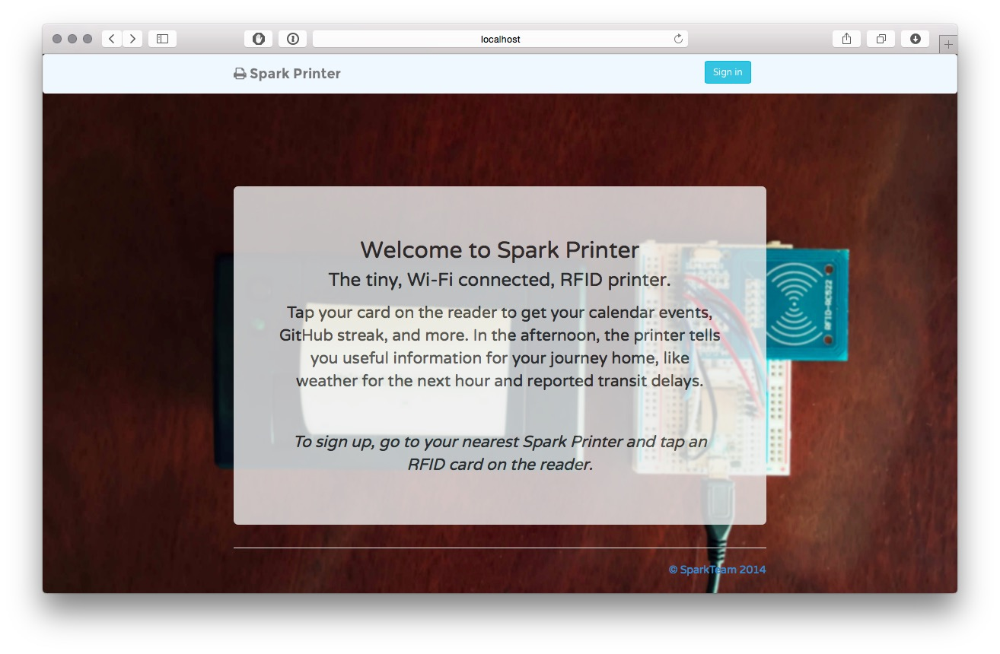

# Spark Printer Server

Server app for controlling and configuring **Spark Printer**, a tiny, wireless, RFID-enabled personal printing platform.

Start by tapping your RFID card on the reader – Spark Printer will print out a link for you to follow. There, you can register and customise your printouts. Once set up, tap your card on the reader to receive a personalised, context-aware printout.

The server handles user signup and login, and parses and formats messages for printing before sending them to the printer using the [Spark Cloud API](http://docs.spark.io/api/).

## Technologies

* Ruby
* Sinatra
* Postgres
* DataMapper
* node.js server for pushing RFID scans to the main Sinatra server for handling
* RSpec and Capybara for testing